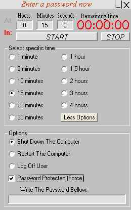



## Power\-O

### Description

A shutdown application with support of win95,win98,win2000,winXP.It can restart,shutdown or logoff your computer with password protection(in win9x).You can input coutdown time or just time.It supports command line options like /restart /now.Very easy and quick to use.(right click on start and on header for more options)
 
### More Info
 

             |
---                |---
**Submitted On**   |2003-03-05 13:49:22
**By**             |[Fotis Pap\.](https://github.com/Planet-Source-Code/PSCIndex/blob/master/ByAuthor/fotis-pap.md)
**Level**          |Beginner
**User Rating**    |4.8 (19 globes from 4 users)
**Compatibility**  |VB 5\.0, VB 6\.0
**Category**       |[Complete Applications](https://github.com/Planet-Source-Code/PSCIndex/blob/master/ByCategory/complete-applications__1-27.md)
**World**          |[Visual Basic](https://github.com/Planet-Source-Code/PSCIndex/blob/master/ByWorld/visual-basic.md)
**Archive File**   |[Power\-O155536362003\.zip](https://github.com/Planet-Source-Code/fotis-pap-power-o__1-43767/archive/master.zip)

